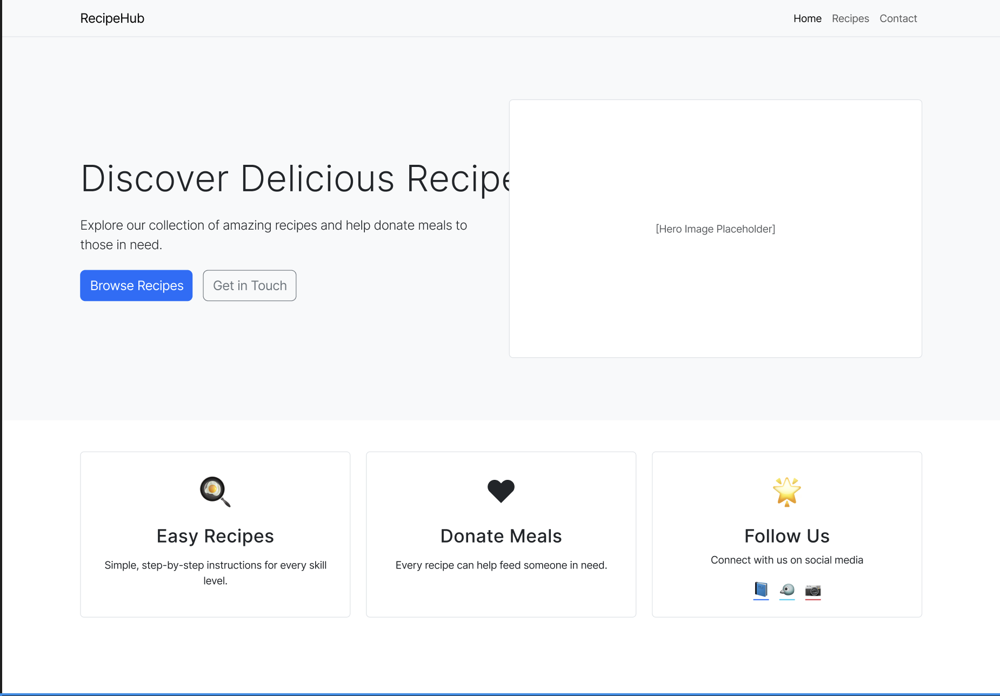
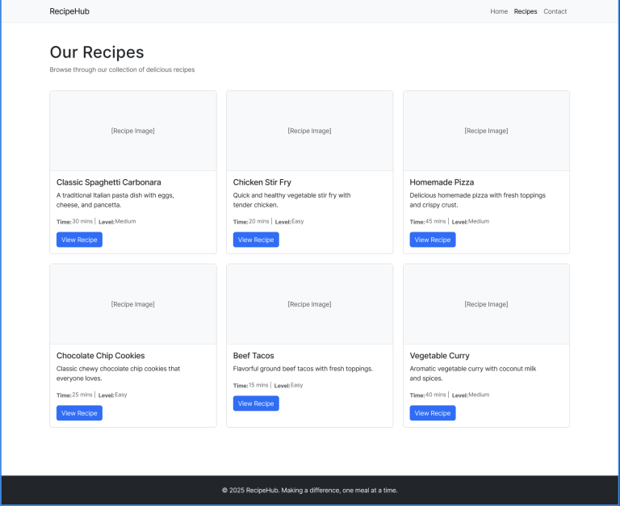
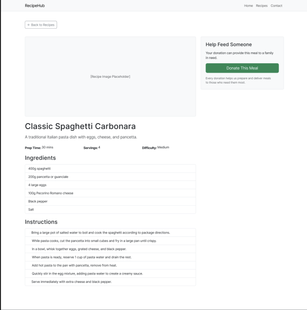
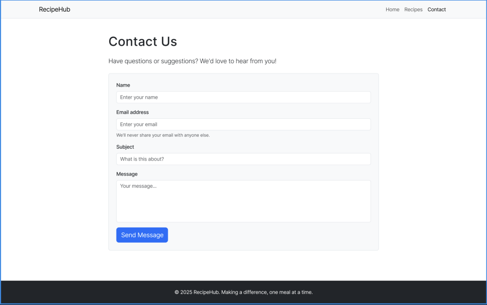
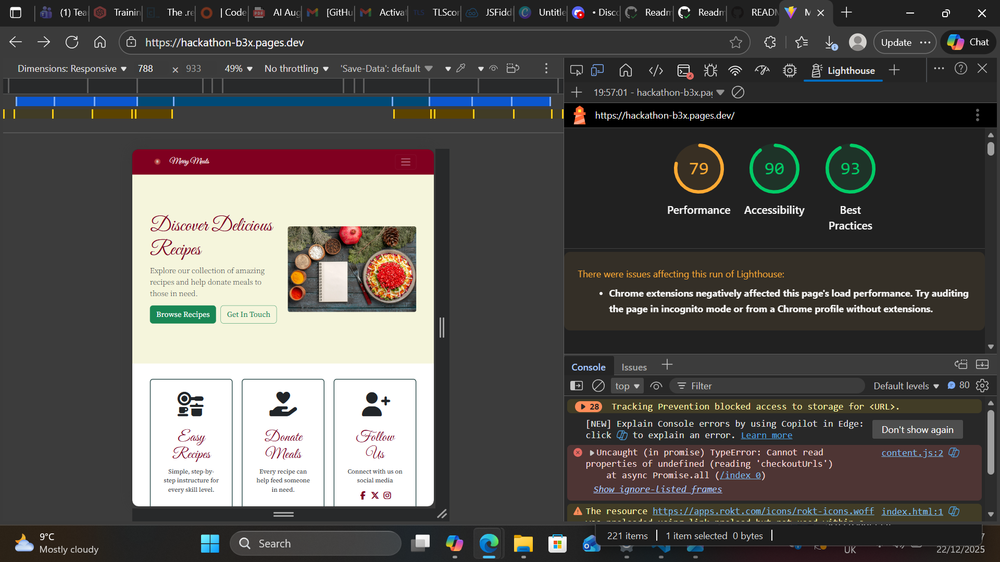

# Recipe App - Hackathon Project

https://hackathon-b3x.pages.dev/

A multi-page vanilla JavaScript application using Vite, Bootstrap, and Zod for form validation.

## Project Architecture

This is a **multi-page application** (not a single-page app). Each page is a separate HTML file with its own JavaScript and CSS. Pages are organized in a modular structure for better maintainability.

## Current Pages

The application currently has four pages:

1. **Home** (`/` or `/index.html`) - Welcome page with lorem text
   - Files: `index.html`, `src/pages/home/main.js`, `src/pages/home/style.css`

2. **Recipes** (`recipes.html`) - Browse recipe cards
   - Files: `recipes.html`, `src/pages/recipes/recipes.js`, `src/pages/recipes/style.css`
   - Fetches recipes from TheMealDB API
   - Displays 21 recipes in a grid

3. **Recipe Detail** (`/recipe-detail.html?id=123`) - View single recipe
   - Files: `recipe-detail.html`, `src/pages/recipe-detail/recipe-detail.js`, `src/pages/recipe-detail/style.css`
   - Shows recipe image, instructions, and details
   - Includes "Donate this meal" button

4. **Contact** (`/contact.html`) - Contact form with validation
   - Files: `contact.html`, `src/pages/contact/contact.js`, `src/pages/contact/style.css`
   - Uses Zod for form validation

## Current Components

The application has several reusable components:

1. **Donate Button** (`src/components/donate-button/`)
   - Used on recipe detail page
   - Opens charity selection modal

2. **Charity List** (`src/components/charity-list/`)
   - Modal displaying GlobalGiving food security projects
   - Shows project cards with donation options

3. **Charity Card** (`src/components/charity-card/`)
   - Individual charity project card component
   - Displays project details and donation button

**Note**: The navbar is static HTML included directly in each page (not a component) to prevent Flash of Unstyled Content.

## Donate This Meal Feature

The recipe detail page includes a unique donation feature that calculates the cost of the meal you're viewing and allows you to donate that amount to hunger relief charities.

### How It Works

#### 1. Recipe Viewing
When you view a recipe, the app analyzes the recipe category (Pasta, Chicken, Beef, etc.) to estimate the approximate cost to make that meal.

#### 2. Meal Value Estimation & Currency Detection
The system estimates meal costs and automatically displays them in your local currency:

**Base Meal Costs (in EUR)**:

| Recipe Category | Base Cost (EUR) | Example: US ($) | Example: UK (£) |
|----------------|-----------------|-----------------|-----------------|
| Pasta | €8 | $9 | £7 |
| Vegetarian | €10 | $11 | £9 |
| Vegan | €10 | $11 | £9 |
| Breakfast | €10 | $11 | £9 |
| Side | €8 | $9 | £7 |
| Dessert | €12 | $13 | £10 |
| Chicken | €15 | $17 | £13 |
| Pork | €18 | $20 | £15 |
| Beef | €25 | $28 | £21 |
| Lamb | €28 | $31 | £24 |
| Seafood | €30 | $33 | £26 |
| Default | €15 | $17 | £13 |

**Currency Detection**:
- Uses IP geolocation to detect your country (via geojs.io - no rate limits)
- Result cached in browser for 24 hours to minimize API calls
- Automatically determines your currency (USD, EUR, GBP, etc.)
- Converts meal values from EUR to your local currency
- Displays amounts with your local currency symbol ($, €, £, etc.)

**Supported Currencies**: USD, EUR, GBP, CAD, AUD, JPY, CHF, NZD, SEK, NOK, DKK

**Implementation**:
- Meal estimation: `src/services/globalgiving.js:59-101`
- Currency detection: `src/services/location.js:12-43`
- Currency conversion: `src/services/currency.js`

#### 3. Charity Selection
When you click "Donate this meal":
- A modal opens showing 6 GlobalGiving food security projects
- The modal displays: "You're viewing **[Recipe Name]**, which costs approximately **$X** to make" (in your currency)
- All charities show donation buttons with the calculated meal value (e.g., "Donate $9" for US users, "Donate €8" for EU users)

#### 4. Donation Flow
When you click a charity's "Donate $X" button (amount shown in your currency):
1. **Direct to Cart**: The link uses GlobalGiving's cart URL format for immediate checkout:
   ```
   https://www.globalgiving.org/dy/cart/view/gg.html?cmd=addItem&projid=X&frequency=ONCE&amount=Y
   ```
2. **Opens in New Tab**: The donation page opens in a new tab
3. **Pre-filled Amount**: The donation amount is automatically filled in your local currency
4. **Minimum Amount**: A minimum of $5 (or equivalent) is enforced
5. **GlobalGiving Tip**: GlobalGiving automatically adds an optional tip to support their platform (this is their standard behavior and cannot be disabled from our side)

**Implementation**: See `src/services/globalgiving.js:103-112` for the `getDonationUrl()` function.

### GlobalGiving API Integration

The charity data comes from the GlobalGiving API:
- **Search Endpoint**: Uses the search API with theme filter (automatically excludes inactive projects)
- **Theme Filter**: Queries the "hunger" theme for food security projects
- **Active Projects Only**: Only active, live projects are returned (inactive/retired projects filtered out)
- **Project Count**: Fetches 6 projects to display in the modal
- **Data Included**: Organization name, project title, description, funding progress, country, images
- **Setup Required**: You need a free GlobalGiving API key (see `GLOBALGIVING_SETUP.md` for instructions)

### Files Involved

```
src/
├── services/
│   ├── globalgiving.js          # Meal value estimation, donation URL generation, API calls
│   ├── location.js              # User location & currency detection via IP geolocation
│   └── currency.js              # Currency conversion rates, formatting helpers
├── components/
│   ├── donate-button/           # "Donate this meal" button component
│   ├── charity-list/            # Charity selection modal with currency display
│   └── charity-card/            # Individual charity project cards
└── pages/
    └── recipe-detail/
        └── recipe-detail.js     # Integrates donation feature with recipe display
```

### Example Flow

**Scenario**: US user views "Spicy Arrabiata Penne" recipe

1. **Location Detection**: System detects user is in US → Currency: USD ($)
2. **Recipe loads**: Category is "Pasta"
3. **Calculation**:
   - Base value: €8 (EUR)
   - Converted: $9 (USD) using rate 1.1
4. **User clicks**: "Donate this meal" button
5. **Modal shows**:
   - "You're viewing Spicy Arrabiata Penne, which costs approximately **$9** to make"
   - 6 charity cards, each with "Donate $9" button
6. **User selects**: A charity (e.g., "Micro-farming among the poor Cape Town")
7. **Redirects to**: `https://www.globalgiving.org/dy/cart/view/gg.html?cmd=addItem&projid=714&frequency=ONCE&amount=9`
8. **GlobalGiving page**: Shows donation form with $9 pre-filled + optional tip

**Note**: For users in Europe, the same pasta recipe would show "€8". For UK users, it would show "£7".

### Customization

**Change meal value estimates**:
Edit the `categoryValuesEUR` object in `src/services/globalgiving.js:70-91` (values are in EUR)

**Change currency conversion rates**:
Edit the `CURRENCY_DATA` object in `src/services/currency.js:11-42`

**Add support for more currencies**:
Add new entries to `CURRENCY_DATA` and `COUNTRY_TO_CURRENCY` in `src/services/currency.js`

**Change number of charities shown**:
Modify the `limit` parameter in `recipe-detail.js:57` (currently 6)

**How Currency Works**:
1. All meal values are defined in EUR (base currency)
2. User's location is detected via IP (geojs.io) and cached for 24 hours
3. System converts EUR to user's local currency
4. UI displays amounts with correct currency symbol
5. GlobalGiving receives the numeric amount and displays it in the user's preferred currency

**Minimum Donation**: A minimum of $5 USD (or equivalent) is enforced to meet GlobalGiving's requirements (see `getDonationUrl()` in `src/services/globalgiving.js:107`).

## Prerequisites

### 2. Get a GlobalGiving API Key (Required for Donation Feature)

The "Donate This Meal" feature requires a free API key from GlobalGiving:

1. **Get Your API Key**
   - Visit [globalgiving.org/dy/v2/user/api/](https://www.globalgiving.org/dy/v2/user/api/)
   - Click "Get API Key" - it generates instantly
   - Copy your API key

2. **Configure Your Project**
   - Copy `.env.example` to create a `.env` file:
     ```bash
     cp .env.example .env
     ```
   - Open `.env` and add your API key:
     ```
     VITE_GLOBALGIVING_API_KEY=your-actual-api-key-here
     ```
   - Save the file

**Note**: The `.env` file is in `.gitignore` and won't be committed to git (keeps your API key secure).

For more details, see `GLOBALGIVING_SETUP.md`.

## Using Bootstrap

Bootstrap is already configured and imported in `src/main.css`, which is loaded in the `<head>` of each HTML file to prevent Flash of Unstyled Content (FOUC).

## Using Zod for Form Validation

Zod is a TypeScript-first schema validation library that works great with vanilla JavaScript.

## How Pages Work

Each page consists of three files:

1. **HTML file** (at project root) - Minimal structure
2. **JavaScript file** (in `src/pages/[page-name]/`) - Page logic
3. **CSS file** (in `src/pages/[page-name]/`) - Page-specific styles

### How CSS Imports Work

This project uses a **hybrid approach** for CSS to prevent Flash of Unstyled Content (FOUC):

**Global CSS (Bootstrap, shared styles)**: Loaded in HTML `<head>` via `src/main.css`
- `<link rel="stylesheet" href="/src/main.css">` in each HTML file
- `src/main.css` imports Bootstrap and global styles
- Loads before page renders to prevent FOUC
- Navbar is directly in HTML with styles ready

**Page-specific CSS**: Imported in JavaScript files
- `import './style.css'` in your page's JS file
- Vite processes these imports automatically

**Development Mode** (`npm run dev`):
- Vite processes `<link href="/src/main.css">` and CSS imports in JS files
- Injects CSS as `<style>` tags into the page
- Changes trigger hot-reload (instant updates)

**Production Build** (`npm run build`):
- Vite bundles all CSS into optimized `.css` files
- CSS is minified and cached

### Component Structure

Each component has its own folder with:
- `component-name.js` - Component logic
- `component-name.css` - Component styles


### Note About the Navbar

The navbar is **not a JavaScript component** in this project. It's static HTML included directly in each HTML file to prevent Flash of Unstyled Content (FOUC). The navbar HTML is copied into each page with the appropriate active link highlighted.

### Recipe Detail Page

**Structure**:
```
src/pages/RecipeDetailPage/
├── RecipeDetailPage.js
├── index.js
└── RecipeDetailPage.css
```

### Contact Page

**Structure**:
```
src/pages/ContactPage/
├── ContactPage.js
├── index.js
└── ContactPage.css
```
## Documentation and Spikes

### What is a Spike?

A **spike** is a time-boxed research task where you investigate a question or explore how to implement something. It helps you learn before you code.

**Examples**:
- "Which recipe API should we use?"
- "How do we upload images?"
- "Can we add user authentication?"

### Creating Documentation

The `docs/` folder is for all project documentation:

- **Spikes**: Research documents (`docs/spikes/`)
- **Technical decisions**: Why you chose an approach
- **Setup guides**: Special instructions
- **API documentation**: How your code work?

## Project Structure

```
hackathon/
├── index.html                      # Home page HTML
├── recipes.html                    # Recipes list page HTML
├── contact.html                    # Contact form page HTML
├── recipe-detail.html              # Recipe detail page HTML
├── vite.config.js                  # Vite build configuration
├── package.json                    # Dependencies and scripts
└── src/
    ├── main.css                    # Main CSS entry (Bootstrap + global styles)
    ├── components/                 # Reusable UI components
    │   └── donate-button/
    │       ├── donate-button.js    # Donate button component
    │       └── donate-button.css   # Donate button styles
    ├── pages/                      # Page-specific code
    │   ├── home/
    │   │   ├── main.js             # Home page JavaScript
    │   │   └── style.css           # Home page styles
    │   ├── recipes/
    │   │   ├── recipes.js          # Recipes list JavaScript
    │   │   └── style.css           # Recipes page styles
    │   ├── contact/
    │   │   ├── contact.js          # Contact form JavaScript
    │   │   └── style.css           # Contact page styles
    │   └── recipe-detail/
    │       ├── recipe-detail.js    # Recipe detail JavaScript
    │       └── style.css           # Recipe detail styles
    └── styles/
        └── global.css              # Global/shared styles
```

### Architecture Principles

1. **HTML at Root**: Each page has its own HTML file at the project root for simple URLs
2. **Page Folders**: Page-specific JavaScript and CSS are organized in `src/pages/[page-name]/`
3. **Reusable Components**: Shared UI elements live in `src/components/[component-name]/`
4. **Component Co-location**: Each component has its own folder with `.js` and `.css` files together
5. **Hybrid CSS Loading**:
   - Global styles (Bootstrap, shared CSS, navbar) loaded in HTML via `src/main.css` to prevent FOUC
   - Page-specific styles imported in JavaScript files
6. **Static Navbar**: Navbar HTML is included directly in each page (not inserted via JavaScript) to prevent flash on load

# color pallete and fonts 

color pallets used include:
  burgundy: #800020;
  forest-green: #2F4F4F;
  antique-gold: #D4AF37;
  warm-cream: #F5F5DC;

fonts used inlude:
font-family: 'Great Vibes', cursive
font-family: "Source Serif 4", serif

# wireframe 








# lighthouse performance



